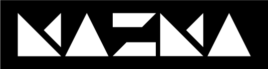

<!DOCTYPE html>
<html lang="it">
<head>
  <meta charset="UTF-8">
  <title>Chi sono - MazmaArt</title>
  <link rel="stylesheet" href="style.css">
</head>
<body>
  <nav>
    
MazmaArt

    <ul>
      <li><a href="chisono.html">Chi sono</a></li>
      <li><a href="fotografia.html">Fotografia</a></li>
      <li><a href="cloisonne.html">Cloisonné</a></li>
      <li><a href="contatti.html">Contatti</a></li>
    </ul>
  </nav>
  <!-- Stesso nav e footer, cambia solo il titolo e il contenuto -->
<title>Fotografia - MazmaArt</title>
<h1>Fotografia</h1>

Galleria di fotografie artistiche e personali.

<title>Cloisonné - MazmaArt</title>
<h1>Cloisonné</h1>

Opere create con tecnica cloisonné: smalto, rame, simbolismo.

<title>Contatti - MazmaArt</title>
<h1>Contatti</h1>

Email: <a href="mailto:mazmaart@gmail.com">mazmaart@gmail.com</a>

Instagram: <a href="https://www.instagram.com/mazmaart.grazi" target="_blank">@mazmaart.grazi</a>

  
</head>
<body>
  <nav>
    
MazmaArt

    <ul>
      <li><a href="#about">Chi sono</a></li>
      <li><a href="#works">Opere</a></li>
      <li><a href="#contact">Contatti</a></li>
    </ul>
  </nav>

  <header>
    <h1>Arte che parla all'anima</h1>
  </header>

  <section id="about">
    <h2>Chi sono</h2>
    
Ciao! Sono MazmaArt, artista specializzata in cloisonné e tecniche decorative ispirate al simbolismo e alla materia. Creo opere che fondono luce, metallo e colore per evocare emozioni profonde.

  </section>

  <section id="works">
    <h2>Opere</h2>
    

      
      
      
    

  </section>
  <header>
  

    
    <h1>MazmaArt</h1>
  

  
"L'arte non riproduce ciò che è visibile, ma rende visibile ciò che non sempre lo è."

</header>

  <section id="contact">
    <h2>Contatti</h2>
    
Email: <a href="mailto:mazmaart@gmail.com">mazmaart@gmail.com</a>

    
Instagram: <a href="https://www.instagram.com/mazmaart" target="_blank">@mazmaart.grazi</a>

  </section>

  <footer>
    
&copy; 2025 MazmaArt. Tutti i diritti riservati.

  </footer>
</body>
</html>
 

  
